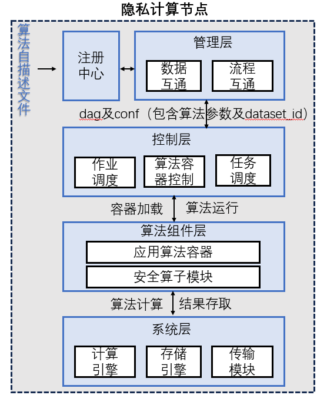

# 算法组件层规范及接口

## 说明

本文档为隐私计算互联互通算法组件层规范及接口，目前主要面向金融行业，并随时针对各行业、各单位针对互联互通提出的讨论和建议做优化。

## 版权

本标准由北京金融科技产业联盟（Beijing FinTech Industry Alliance）牵头起草，各个隐私计算技术服务商各自实现该标准，版权由北京金融科技产业联盟所有。

**开源协议**

无

## 联系人信息

关于文件内容如有问题可以联系我们，联系方式如下：

| 姓名   | 单位     | 联系方式               |
| ------ | -------- | ---------------------- |
| 丁亚丹 | 中国银联 | dingyadan@unionpay.com |

## 内容目录

- 1 整体框架

- 2 算法组件自描述文件

- 3 算法组件与控制层交互

- 4 算法组件与存储层交互

- 5 算法组件与计算引擎交互

- 6 算法组件与传输层交互

## 1 整体框架

算法组件以容器镜像的形式打包存储，每一个算法组件需要具备针对该组件的算法自描述文件以供他方算法注册与使用加载。此外，算法组件层与控制层（调度层）、传输层以及系统层（计算、存储）等均有信息交互，需要遵循相应的规范和接口。框架图如下：



## 2 算法组件自描述文件

每个算法组件应提供配套的算法组件自描述文件以增强算法的可扩展性。其中应包含算法功能、超参数、输入数据、输出结果等描述信息。算法自描述模板参考如下：

```json
{
    componentName: "${componentName}", //算法组件名称，跟算法容器的环境变量相对应

    title: "${title}", //页面显示名称

    provider: "${provider}", //算法提供商

    version: "${version}", //算法版本

    description: "${description}", //算法描述

    roleList: "${roleList}", //[必须]算法支持的角色定义,数组类型。例如：["guest", "host","arbiter"]

    desVersion: "${desVersion}", //[可选]描述文件采用的版本

    storageEngine:"${storageEngine}",//[必须]说明算法组件所支持的存储引擎，数组类型。如：["s3", "hdfs","eggroll"]

    /**
     * 描述算法输入参数
     * 输入参数这里是指如算法超参相关的信息,和算法组件输入的数据区分开来,参考inputData的描述
     **/
    inputParam: [{
        name: "${name}", //输入字段的形式参数名称，跟算法容器的环境变量相对应
        title: "${title}", //页面显示字段标题
        description: "${description}", //参数描述
        type: "${type}", //描述输入字段的类型
        /**
         * 以下给出常用的几种数据类型:
         * string：字符串类型
         * int: 整数类型
         * float: 浮点数类型
         * boolean: 布尔类型
         * integer: 整型对象，可以为null
         * number: 数值型，包括整数和小数（当不具体区分整型和浮点型时采用该种类型）
         * object: 复杂类型,可以使用json表示,前端就具体的json数据结构可扩展相关控件。
         * ...等其他类型
        **/
        bindingData: "${bindingData}", //[可选],可枚举的静态绑定数据,可以引用外部其它函数获取控件绑定的数据,如可渲染下拉菜单、单选框、多选框等的数据获取方式       
        /**
         * 例如1:静态绑定数据
         * bindingData:"[{label: "${label}",value: "${value}"}]",其中是可以执行的 kv Json，格式参考为kv数组。
         *
         * 例如2:动态绑定数据
         * bindingData:"call_function getKV()"。//定义一个调用的回调函数获取数据，
         * 这里的call_function作为一个函数调用的标识符使用，解析执行器使用call_function作为标识符判断，用于与静态值区别，
         * 后面的getKV()，解析执行器需要保障执行上下文中存在可调用的getKV()函数，getKV()的函数命名，在实际使用中，可自定义。
        **/
        optional: "${optional}", //[必选],表示该参数是必须的还是可选的,默认为true表示可选,false表示必填
        defaultValue: "${defaultValue}", //[可选],输入的默认值。
        validator: "${validator}", //[可选],选择一个字段校验器,如可以写成 regular:'正则表达式',来做正则验证；使用（inf,sup）来对数值的上下界限进行限定
        dependsOn: "${dependsOn}", //[可选]只用于bindingData,表示算法的条件参数，用于组件内部依赖关系展示,默认为空值。若依赖于上游参数，则提供依赖列表，如：["param.value",""]
        /*以下字段跟前端显示及渲染有关，供前端展示参考*/
        UIPattern: "${UIPattern}", //[可选],表示字段的UI模式,默认为editeable,此外有readOnly表示只读,hidden,表示隐藏控件
        groupTag: "${groupTag}", //[可选] 分组标签,用于分组显示,如[默认分组-显示、高级分组-默认不显示]
        UIType: "${UIType}" //[可选],表示前端采用的控件类型,默认为input,其它的比如textArea,numberPicker、checkbox、redio、switch、select、selectTree等
    }],


    /**
     * 
     * 描述算法组件在运行时的输入数据
     * 
     **/
    inputData: [{

        name: "${name}", //输入数据的形式参数名称，跟算法容器的环境变量相对应

        description: "${description}", //输入数据描述信息

        category: "${category}", //输入数据的类型 model、dataset、training_set、test_set、datasets（多个数据文件）

        dataFormat:"${dataFormat}" //[可选]自持的输入数据文件格式，数组类型，默认取第一个。如：["csv","pmml","json","yaml","zip"]

    }],

    /**
     * 
     * 描述算法组件在运行时的输出数据
     * 
     **/
    outputData: [{

        name: "${name}", //输出数据的形式参数名称，跟算法容器的环境变量相对应

        description: "${description}", //输出数据描述信息

        category: "${category}" ,//输出数据的类型 model、dataset、training_set、test_set、report、metric

        dataFormat:"${dataFormat}" //[可选]支持的输出数据文件格式，数组类型，默认取第一个。如：["csv","pmml","json","yaml","zip"]

        
    }],
    /**
     * 
     * 描述算法组件的异常
     * 
     **/
    result: [{
        resultCode: "${resultCode}",

        resultMessage: "${resultMessage}"
    }]
}
```

## 3 算法组件与控制层交互

算法组件与控制层需要按照约定的参数传递规范与算法控制接口进行信息交互，具体接口包括以下：

* POST 任务信息查询接口（query）

POST /v1/platform/algorithm/task/query

某个参与方的调度层获取算法组件层的任务运行状态时调用的接口

> Body 请求参数

```json
{
  "task_id": "string"
}
```

请求参数

| 名称      | 位置 | 类型   | 必选 | 中文名 | 说明 |
| --------- | ---- | ------ | ---- | ------ | ---- |
| body      | body | object | 否   |        | none |
| » task_id | body | string | 是   | 任务ID | none |

> 返回示例

> 200 Response

```json
{
  "code": 200,
  "status": "RUNNING",
  "role": "host",
}
```

返回结果

| 状态码 | 状态码含义                                              | 说明 | 数据模型 |
| ------ | ------------------------------------------------------- | ---- | -------- |
| 200    | [OK](https://tools.ietf.org/html/rfc7231#section-6.3.1) | 成功 | Inline   |

返回数据结构

状态码 **200**

| 名称     | 类型    | 必选 | 约束 | 中文名   | 说明                     |
| -------- | ------- | ---- | ---- | -------- | ------------------------ |
| » code   | integer | true | none | 状态码   | 200正常，否则错误        |
| » status | string  | true | none | 任务状态 | RUNNING、SUCCESS、FAILED |
| » role   | string  | true | none | 角色     | 任务节点所属角色         |

## 4 算法组件与存储层交互

算法组件应支持本地存储或主流的存储引擎接口，并在自描述文件中说明所支持的存储引擎类型。算法组件宜支持大数据量输入与输出情形的处理。

算法容器根据调度层下发的环境变量获取数据集地址及结果集的输出地址

* 算法容器从指定地址获取并加载数据集信息

* 算法容器输出计算结果集到指定数据地址

调度层生成数据存储路径规则，并通过环境变量env下发给算法组件层：

1. S3存储：s3://{bucket}/{key}

```
s3.Object(bucket_name="storage", key="{}-{}".format(namespace, name))
```

2. hdfs存储：/XXX/XXX
3. nfs存储：/XXX/XXX

## 5 算法组件与计算引擎交互

算法组件应支持本地计算或主流的计算引擎接口，并在自描述文件中说明所支持的计算引擎类型。算法组件宜支持算力的水平或垂直扩展，如计算集群或者硬件加速：

1. 本地计算：算法组件基于内存方式完成计算任务
2. 计算引擎：基于yarn-client方式部署spark引擎，基于eggroll的计算引擎

* eggroll：算法容器通过eggroll-client组件将计算任务下发至nodemanager计算引擎中，执行map-reduce操作。

* spark：client端执行算法容器，通过Spark的DAG调度服务，将计算任务下发至worker节点中的executer组件，执行map-reduce操作。


## 6 算法组件与传输层交互

算法模块应支持与传输模块所约定的接口与报文规范，实现与多方协作通信完成算法任务，接口参照如下：

* 数据发送接口

算法组件调用通信模块发送数据

```shell
HTTP POST /v1/interconn/chan/push
请求头:
x-ptp-tech-provider-code:    required 厂商编码
x-ptp-trace-id:              required 链路追踪ID
x-ptp-token                  required 认证令牌
x-ptp-session-id             required 通信会话号，全网唯一
x-ptp-target-node-id         required 接收端节点编号，全网唯一
x-ptp-target-inst-id         optional 接收端机构编号，全网唯一
```

**请求体**

| 参数名称 | 数据类型 | 默认值 | 是否必填 | 描述                                                 |
| -------- | -------- | ------ | -------- | ---------------------------------------------------- |
| payload  | byte\[]  | 空     | true     | 消息序列化后的字节数组                               |
| topic    | string   | 空     | false    | 会话主题，相同信道具有唯一性，用于同一信道的传输隔离 |
| metadata | object   | 空     | false    | 保留参数，用于扩展性                                 |

**响应体**

| 参数名称 | 类型   | 默认值      | 是否必填 | 描述                                       |
| -------- | ------ | ----------- | -------- | ------------------------------------------ |
| code     | string | E0000000000 | true     | 状态码，E0000000000 表示成功，其余均为失败 |
| message  | string | 成功        | true     | 状态说明                                   |

* 接收数据接口

算法组件调用通信模块接口获取数据，该接口会从通信信道中阻塞读取一次数据，如信道中无数据，会一直阻塞等待触发超时返回空

```shell
HTTP POST /v1/interconn/chan/pop
请求头:
x-ptp-tech-provider-code:    required 厂商编码
x-ptp-trace-id:              required 链路追踪ID
x-ptp-token                  required 认证令牌
x-ptp-session-id             required 通信会话号，全网唯一
x-ptp-target-node-id         required 接收端节点编号，全网唯一
x-ptp-target-inst-id         optional 接收端机构编号，全网唯一
```

**请求体**

| 参数名称 | 数据类型 | 默认值 | 是否必填 | 描述                                                 |
| -------- | -------- | ------ | -------- | ---------------------------------------------------- |
| timeout  | byte\[]  | 空     | false    | 阻塞超时时间，默认 120s                              |
| topic    | string   | 空     | false    | 会话主题，相同信道具有唯一性，用于同一信道的传输隔离 |

**响应体**

| 参数名称 | 类型    | 默认值      | 是否必填 | 描述                                        |
| -------- | ------- | ----------- | -------- | ------------------------------------------- |
| code     | string  | E0000000000 | true     | 状态码，E000 0000000 表示成功，其余均为失败 |
| message  | string  | 成功        | true     | 状态说明                                    |
| content  | byte\[] | 空          | false    | 消息序列化后的字节数组                      |

* 快速获取数据接口

算法组件调用通信模块接口快速获取数据，即在非阻塞情况下从通信信道中读取一次数据，若信道中有数据则返回数据，无数据则返回空。

```shell
HTTP POST /v1/interconn/chan/peek
请求头:
x-ptp-tech-provider-code:    required 厂商编码
x-ptp-trace-id:              required 链路追踪ID
x-ptp-token                  required 认证令牌
x-ptp-session-id             required 通信会话号，全网唯一
x-ptp-target-node-id         required 接收端节点编号，全网唯一
x-ptp-target-inst-id         optional 接收端机构编号，全网唯一
```

**请求体**

| 参数名称 | 数据类型 | 默认值 | 是否必填 | 描述                                                 |
| -------- | -------- | ------ | -------- | ---------------------------------------------------- |
| topic    | string   | 空     | false    | 会话主题，相同信道具有唯一性，用于同一信道的传输隔离 |

**响应体**

| 参数名称 | 类型    | 默认值      | 是否必填 | 描述                                       |
| -------- | ------- | ----------- | -------- | ------------------------------------------ |
| code     | string  | E0000000000 | true     | 状态码，E0000000000 表示成功，其余均为失败 |
| message  | string  | 成功        | true     | 状态说明                                   |
| content  | byte\[] | 空          | false    | 消息序列化后的字节数组                     |

* 会话释放接口

算法组件调用通信模块接口，清理掉以 x-ptp-session-id 标记的会话，调用该接口会释放会话中未读取的数据。

```shell
HTTP POST /v1/interconn/chan/release
请求头:
x-ptp-tech-provider-code:    required 厂商编码
x-ptp-trace-id:              required 链路追踪ID
x-ptp-token                  required 认证令牌
x-ptp-session-id             required 通信会话号，全网唯一
x-ptp-target-node-id         required 接收端节点编号，全网唯一
x-ptp-target-inst-id         optional 接收端机构编号，全网唯一
```

**请求体**

| 参数名称 | 数据类型 | 默认值 | 是否必填 | 描述                                                 |
| -------- | -------- | ------ | -------- | ---------------------------------------------------- |
| timeout  | byte\[]  | 空     | false    | 释放最长等待时间，默认 10s                           |
| topic    | string   | 空     | false    | 会话主题，相同信道具有唯一性，用于同一信道的传输隔离 |

**响应体**

| 参数名称 | 类型   | 默认值      | 是否必填 | 描述                                       |
| -------- | ------ | ----------- | -------- | ------------------------------------------ |
| code     | string | E0000000000 | true     | 状态码，E0000000000 表示成功，其余均为失败 |
| message  | string | 成功        | true     | 状态说明                                   |

